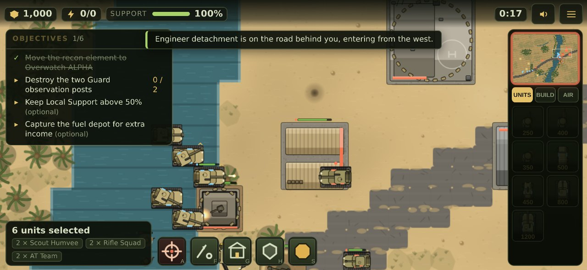

# Operation Iraqi Freedom — Task Force Talon

A tactical real-time strategy prototype in the Command & Conquer tradition, set
during the 2003 advance up Highway 8. Playable in a browser, built phone-first
for touch.

**Everything in it is original and generated at runtime.** There are no image
files, no audio files, no fonts, no libraries. Every tank, soldier and building
is drawn in code with Canvas2D when the page loads; every gunshot, explosion and
note of the score is synthesised with the Web Audio API. The whole game is a few
hundred kilobytes of plain text and it runs offline.



## Play it

```bash
npm start            # serves on http://localhost:8080
```

Any static file server will do — there is no build step. Open it on a phone,
turn the device sideways, and add it to your home screen to run it fullscreen
as an installed app.

## Controls

Designed so that one tap always does the obvious thing.

| Gesture | Action |
|---|---|
| Tap | Select your unit, or give the current selection an order |
| Tap an enemy | Attack it |
| Tap ground | Move there |
| Tap a garrisonable building | Move infantry inside |
| Drag | Look around, with a momentum flick on release |
| Pinch | Zoom about your fingers |
| Long press | Attack-move to that point |
| Long press, then drag | Box-select a group |
| Double tap a unit | Select every unit of that type on screen |
| Minimap | Tap or drag to jump the camera |

Mouse and keyboard work too: left-drag box-selects, right-click orders, the
wheel zooms, `A` attack-move, `F` force fire, `G` garrison, `C` capture,
`R` repair, `H` hold, `S` stop, `Tab` shows weapon ranges, `Ctrl+1..9` sets a
control group.

## What is in the prototype

- **Mission 01, "Highway 8: Bridgehead"** — a 96×72 map of the Euphrates valley
  with a single bridge crossing, six objectives, two optional objectives, three
  timed counterattacks and a full victory/defeat flow with an end-of-mission
  rating.
- **13 units and 19 structures** across two factions plus neutral civilian and
  capturable buildings.
- **A ruleset with real depth**: an armour-versus-damage-type counter matrix,
  four veterancy ranks, terrain cover, building garrison, a power grid with
  brown-outs, supply logistics, and a Rules of Engagement meter.
- **An opposing commander** that maintains a combined-arms force mix, garrisons
  the village, defends its perimeter, rebuilds lost production, and assembles
  strike groups before committing them.

See [docs/DESIGN.md](docs/DESIGN.md) for the full design and the balance tables.

## A note on the setting

This is a military strategy game about a real war. It is built the way the
genre's better entries handle real conflicts: the opposing force is a military
one, every target is a military target, and there is no mechanic anywhere for
attacking people.

The **Local Support** meter is the design's answer to the subject matter rather
than an apology for it. A village sits astride the short route to the bridge.
Shooting your way through it is faster, and it costs you: Local Support falls,
supply income drops, your air support takes longer to arrive, and irregulars
start turning out against you. The fastest path through a built-up area is
often the one that loses you the mission. That is a better strategy game *and*
a more honest one.

## Project layout

```
index.html            page shell        styles.css       interface styling
src/main.js           entry point       src/game.js      controller and loop
src/core/             maths, camera, unified touch/mouse input
src/world/            tile grid, A* pathfinding, fog of war
src/sim/              ruleset, unit definitions, entities, world, AI, effects
src/art/              procedural sprites, terrain painter, palette
src/audio/            synthesised sound effects and the generated score
src/render/           the renderer
src/ui/               HUD, minimap, overlays
src/missions/         mission 01 and its map
tools/                tests, dev server, screenshot and frame-rate harnesses
```

## Tests

The simulation deliberately contains no DOM access, so all of it runs headless.

```bash
npm test             # 24 simulation checks + a full mission playthrough
npm run test:browser # 5 viewports, the portrait nudge, and offline play
npm run perf         # measures real frame rate in Chromium at iPhone size
npm run shots        # captures screenshots of the running game
npm run balance      # regenerates the balance tables in docs/DESIGN.md
```

The browser tests need a server running (`npm start`, then point them at it
with `GAME_URL=http://localhost:8080`) and Playwright's Chromium.

`npm test` covers the economy, production gating, construction radius, pathing
around obstacles, the counter matrix (four rifle squads lose to one tank; two
AT teams beat it), garrison resistance to small arms, ROE penalties, veterancy,
capture, fog, and then plays mission 01 from the opening recon move through to
victory and defeat. `npm run test:browser` drives the real game in Chromium
across five viewports from an iPhone SE to a desktop, checks the order bar never
ends up underneath the production rail, and confirms the game still loads and
plays with the network switched off.

## Performance

Measured in headless Chromium at iPhone 14 Pro dimensions, where Canvas2D is
rasterised in **software** — a deliberately pessimistic floor, since a real
phone composites the canvas on the GPU.

| Scenario | Frame rate |
|---|---:|
| Normal play | 57–60 fps |
| 90-unit battle | 37 fps |
| 90-unit battle, zoomed fully in | 30 fps |

The simulation itself ticks a 120-unit battle in 0.86 ms against a 16.7 ms
budget. Effect density adapts to the measured frame rate, so a weaker device
loses smoke rather than responsiveness.

## Licence

Original work. All art, audio and code in this repository were authored here.
